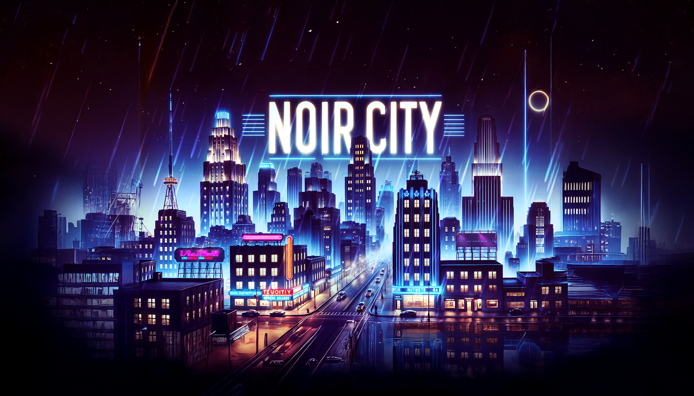

# GameJava – Noir City

**Noir City** es un juego 2D desarrollado en Java con estética noir, inspirado en las películas clásicas de detectives y mafias.  
El jugador recorre escenarios oscuros llenos de peligros, enigmas y guiños al cine negro, con una atmósfera inmersiva gracias a su música original y efectos visuales.

---

## 🎮 Características principales
- **Estética noir**: Inspirada en el cine negro, con escenarios sombríos y alto contraste.
- **Escenario con colisiones**: Mapa en formato PNG con detección precisa de obstáculos.
- **Menú principal animado**: Incluye música compuesta para el juego y efectos de luz en el título.
- **Jugabilidad desafiante**: Mecánicas que ponen a prueba la habilidad del jugador.
- **Ambiente inmersivo**: Música y sonidos creados para reforzar la atmósfera oscura.

---

## 🛠️ Tecnologías y herramientas
- **Lenguaje**: Java  
- **Entorno de desarrollo**: IntelliJ IDEA / Eclipse  
- **Librerías gráficas**: `Java Swing` / `AWT` (según implementación)  
- **Recursos**: Imágenes PNG para el escenario, música y efectos propios.

---

## 📂 Estructura del proyecto
- `src/` → Código fuente del juego.  
- `assets/` → Recursos gráficos y sonoros.  
- `README.md` → Documento actual con información del proyecto.  

---

## 🚀 Autores

- [Juan Jiménez Nieto](https://github.com/True-Felas/Game)
- [Ángel Luis Matador Posada](https://github.com/Luis-matador)
- [David Gutiérrez Ortiz](https://github.com/DavidLazaro08)

---

## Repositorio original:
[True-Felas/Game](https://github.com/True-Felas/Game)

---
> 📌 Este proyecto fue desarrollado como parte de la asignatura de Programación (DAM, 2024-2025), pero con un enfoque creativo y técnico para lograr un resultado jugable y con identidad propia.
